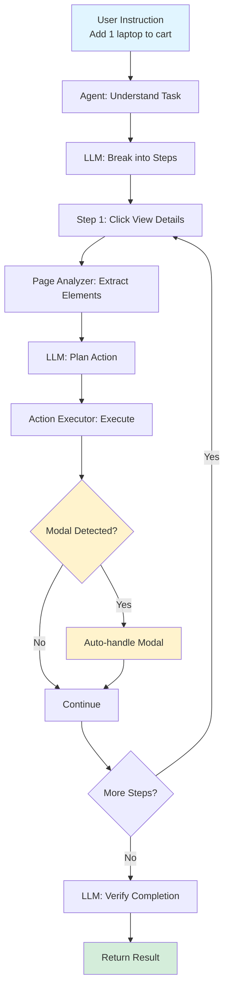
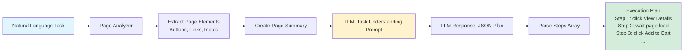
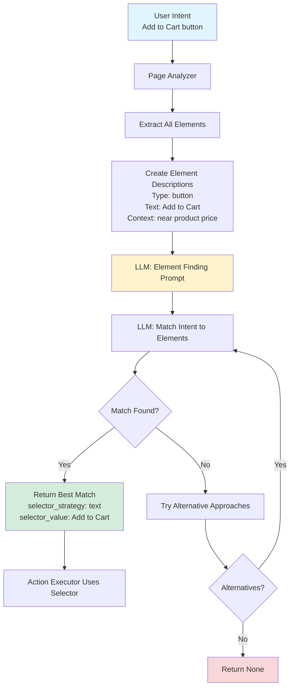
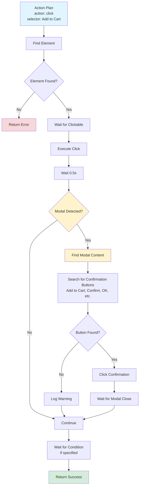
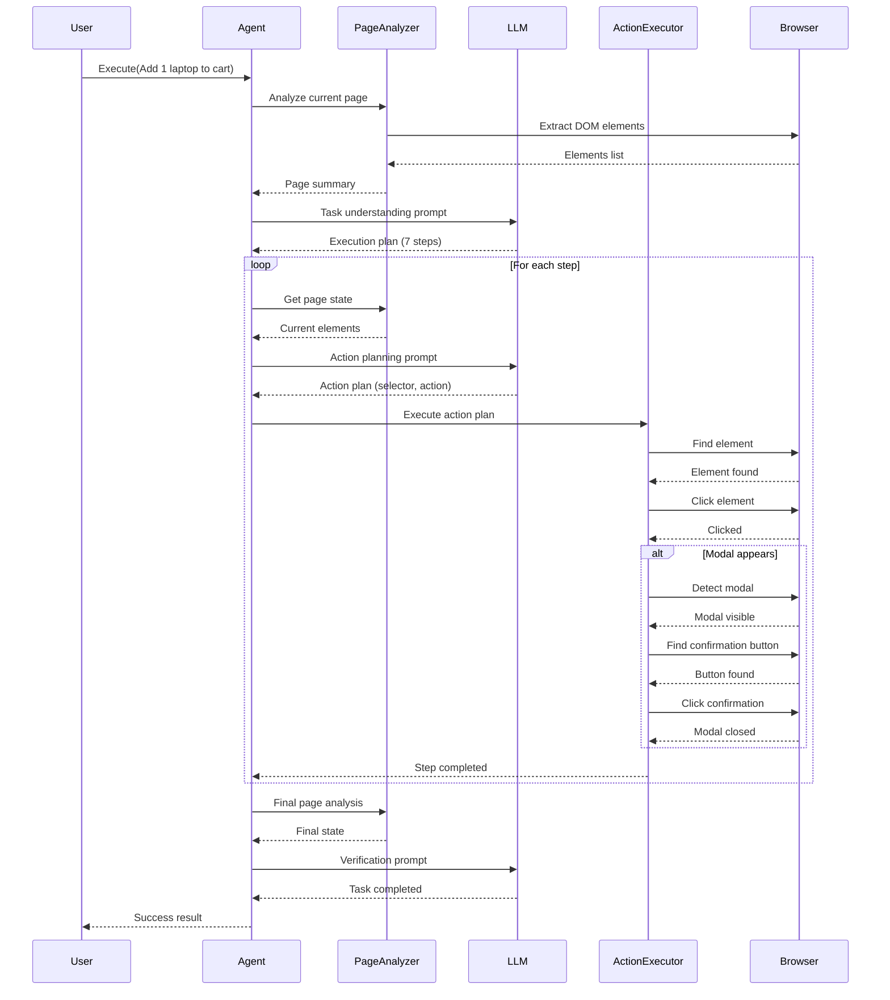

# Agentic Automation System

A general-purpose LLM-powered browser automation system that executes natural language instructions on any website without hardcoded selectors or prior knowledge of page structure.

## Goal

Enable browser automation using only natural language. Instead of writing code like `driver.find_element(By.ID, "addToCart").click()`, simply say **"Add 1 laptop to the cart for checkout"** and the system will:
- Understand the task
- Analyze the page dynamically
- Find elements by semantic meaning
- Execute actions automatically
- Verify completion

## Quick Start

### 1. Set Up API Key

```bash
export OPENAI_API_KEY='your-api-key-here'
```

### 2. Start the Test Website

In a separate terminal:
```bash
cd ../websites/product-catalog
source ../../bauto-venv/bin/activate
python server.py
```

### 3. Run the Example

```bash
cd examples
source ../../bauto-venv/bin/activate

# Run with verbose logging
python product_catalog_example.py --verbose

# Or run quietly
python product_catalog_example.py
```

## How It Works

1. **Task Understanding**: LLM breaks down natural language into actionable steps
2. **Page Analysis**: System extracts all interactive elements and page structure
3. **Element Finding**: LLM matches user intent to page elements semantically
4. **Action Execution**: Selenium actions are executed based on LLM decisions
5. **Verification**: System confirms task completion

### Overall Flow



### Task Understanding Flow



### Element Finding Flow



### Action Execution Flow



### Complete Step Execution Sequence



## Architecture

- **`agent.py`** - Main orchestrator
- **`llm_client.py`** - OpenAI API integration
- **`page_analyzer.py`** - Page structure extraction
- **`element_finder.py`** - Semantic element finding
- **`action_executor.py`** - Selenium action execution
- **`prompts.py`** - LLM prompt templates

### Python-Style Pseudocode

```python
def main():
    driver = setup_chrome_driver()
    llm = LLMClient(model="gpt-4")
    agent = AgenticAgent(driver, llm, verbose=True)
    driver.get("http://localhost:8001/index.html")
    result = agent.execute("Add 1 laptop to the cart for checkout")
    print(result)


class AgenticAgent:
    def __init__(self, driver, llm, verbose):
        self.driver = driver
        self.llm = llm
        self.verbose = verbose
        self.page_analyzer = PageAnalyzer(driver, verbose)
        self.action_executor = ActionExecutor(driver, verbose)
        self.history = []

    def execute(self, task):
        plan = self._understand_task(task)        # LLM call #1
        for step in plan["steps"]:
            summary = self.page_analyzer.summary()
            action = self._plan_action(step, summary)  # LLM calls #2..N
            result = self.action_executor.run(action)
            self.history.append((step, action, result))
        final_summary = self.page_analyzer.summary()
        verification = self._verify(task, final_summary)  # LLM call #N+1
        return {"success": verification["success"], "steps": len(plan["steps"])}


class ActionExecutor:
    def run(self, action_plan):
        if action_plan["action"] == "click":
            element = find_element(action_plan["selector"])
            element.click()
            handle_modal_if_needed()
        elif action_plan["action"] == "type":
            element = find_element(action_plan["selector"])
            element.clear()
            element.send_keys(action_plan["value"])
        wait_if_requested(action_plan.get("wait_for"))
        return {"success": True}


# Call stack
# main()
# └─ AgenticAgent.execute()
#    ├─ _understand_task()  -> LLM creates step plan
#    ├─ loop steps:
#    │    ├─ PageAnalyzer.summary()
#    │    ├─ _plan_action() -> LLM picks selector/action
#    │    └─ ActionExecutor.run() -> Selenium executes + modal handling
#    └─ _verify() -> LLM confirms success
```

## Example Usage

```python
from selenium import webdriver
from agentic_automation.agent import AgenticAgent
from agentic_automation.llm_client import LLMClient

driver = webdriver.Chrome()
llm_client = LLMClient(provider="openai", model="gpt-4")
agent = AgenticAgent(driver, llm_client, verbose=True)

driver.get("http://localhost:8001/index.html")
result = agent.execute("Add 1 laptop to the cart for checkout")

print(f"Success: {result['success']}")
```

## Key Features

- ✅ **No hardcoded selectors** - Works on any website
- ✅ **Natural language** - Plain English instructions
- ✅ **Automatic modal handling** - Detects and handles popups
- ✅ **Self-verifying** - Confirms task completion
- ✅ **Verbose logging** - See exactly what's happening with `--verbose`

## Performance Note

The system makes multiple LLM API calls (one per step), which adds latency (~30-60 seconds for complex tasks). This is expected for a proof-of-concept. Production optimizations would include:
- Batch planning (plan multiple steps at once)
- Caching page analysis
- Skipping LLM calls for simple actions

## Requirements

- Python 3.7+
- OpenAI API key
- Dependencies: `selenium`, `webdriver-manager`, `openai` (see `../requirements.txt`)

